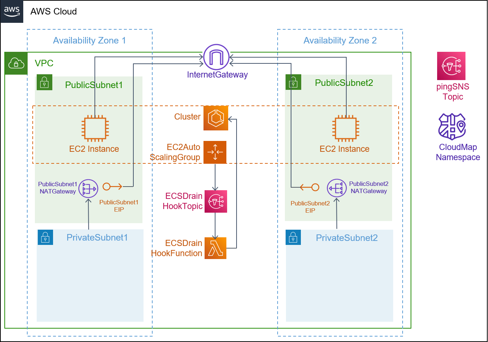
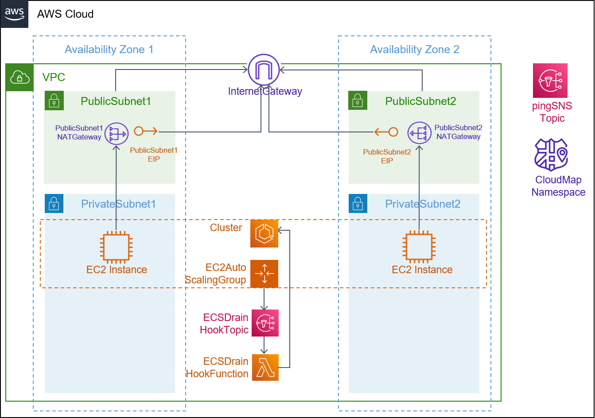

## Description

This template creates a VPC with two public and private subnets across two availability zones. The VPC includes an Internet Gateway and a managed NAT Gateway in each public subnet as well as VPC Route Tables that allow for communication between the public and private subnets. 

It also deploys an ECS cluster to group your fargate tasks and services. An ECS task execution role is created to allow tasks to pull container images from an ECR private repository, and send container logs to CloudWatch Logs. In order to support Service Discovery, we also create a private namespace based on DNS, which is visible only inside the VPC.

We also create an Auto Scaling group to deploy the EC2 instances hosting your containers. The EC2 Auto Scaling service takes care of scaling and maintaining the number of instances in the group. The subnet_type parameter is used to select whether the instances are created in the public subnet or in the private subnet. The desired capacity and the maximum size of the group can be set using the parameters DesiredCapacity, and MaxSize respectively. The template also accepts inputs to choose the EC2 instance type and the AMI for launching the instance. The stack uses Auto Scaling lifecycle hooks and AWS Lambda to automate the process removing tasks from the EC2 instance before scaling down the cluster. Please see [How to Automate Container Instance Draining in Amazon ECS](https://aws.amazon.com/blogs/compute/how-to-automate-container-instance-draining-in-amazon-ecs/) for complete explanation. 

The environment supports asynchronous service-to-service communication using a publish/subscribe model through a shared Amazon SNS topic. In contrast to synchronous communication (i.e. HTTP API), with asynchronous communication, we can avoid blocking the sender to wait for a response as well as decoupling producer from consumer. Multiple services can broadcast events to the SNS topic. All components that subscribe to the topic will receive the message, and can each do something different with the message in parallel.

## Architecture

### Public Subnet

### Private Subnet

## Parameters

1. vpc_cidr: The CIDR range for your VPC
2. public_subnet_one_cidr: The CIDR range for public subnet one
3. public_subnet_two_cidr: The CIDR range for public subnet two
4. private_subnet_one_cidr: The CIDR range for private subnet one
5. private_subnet_two_cidr: The CIDR range for private subnet two
6. subnet_type: Subnet type for your EC2 instances
7. DesiredCapacity: Number of EC2 instances to launch in your ECS cluster
8. MaxSize: Maximum number of EC2 instances that can be launched in your ECS cluster
9. ECSAMI: AMI used to launch the EC2 instances
10. InstanceType: EC2 instance type

## Security

See [CONTRIBUTING](../../CONTRIBUTING.md#security-issue-notifications) for more information.

## License

This library is licensed under the MIT-0 License. See the [LICENSE](../../LICENSE) file.

