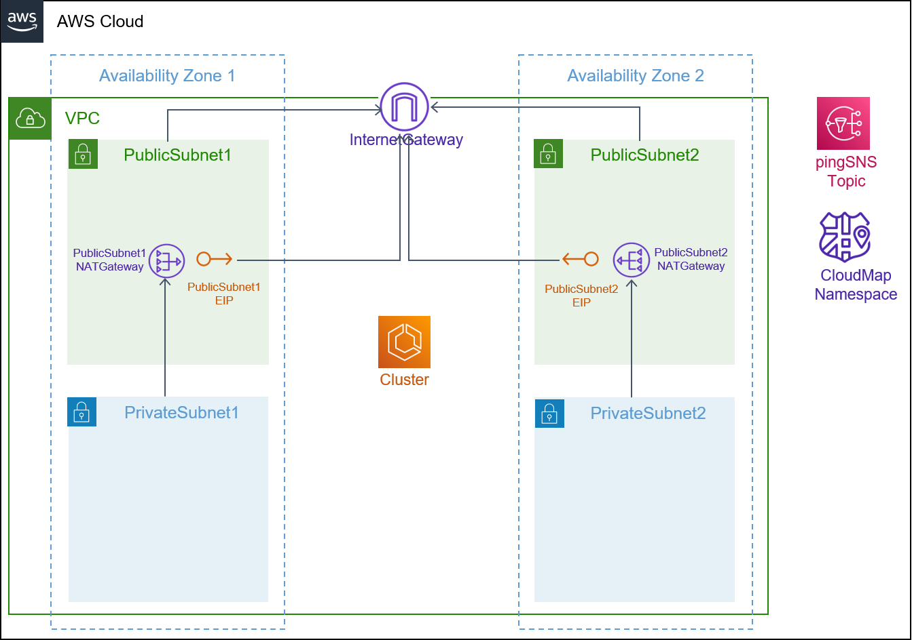

## Description

This template creates a VPC with two public and private subnets across two availability zones. The VPC includes an Internet Gateway and a managed NAT Gateway in each public subnet as well as VPC Route Tables that allow for communication between the public and private subnets. 

It also deploys an ECS cluster to group your fargate tasks and services. An ECS task execution role is created to allow tasks to pull container images from an ECR private repository, and send container logs to CloudWatch Logs. In order to support Service Discovery, we also create a private namespace based on DNS, which is visible only inside the VPC.

The environment supports asynchronous service-to-service communication using a publish/subscribe model through a shared Amazon SNS topic. In contrast to synchronous communication (i.e. HTTP API), with asynchronous communication, we can avoid blocking the sender to wait for a response as well as decoupling producer from consumer. Multiple services can broadcast events to the SNS topic. All components that subscribe to the topic will receive the message, and can each do something different with the message in parallel. 

## Architecture

## Parameters

1. vpc_cidr: The CIDR range for your VPC
2. public_subnet_one_cidr: The CIDR range for public subnet one
3. public_subnet_two_cidr: The CIDR range for public subnet two
4. private_subnet_one_cidr: The CIDR range for private subnet one
5. private_subnet_two_cidr: The CIDR range for private subnet two

## Security

See [CONTRIBUTING](../../CONTRIBUTING.md#security-issue-notifications) for more information.

## License

This library is licensed under the MIT-0 License. See the [LICENSE](../../LICENSE) file.

