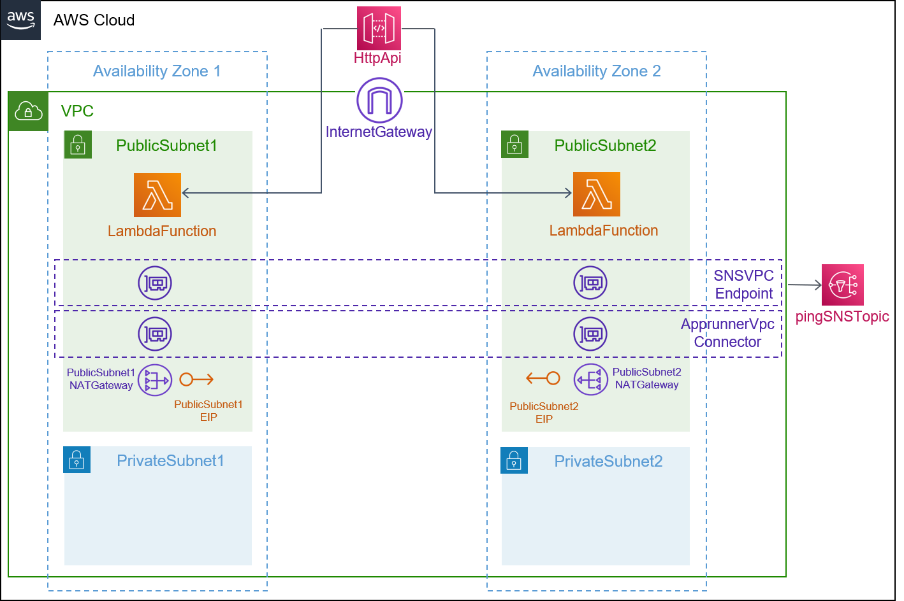
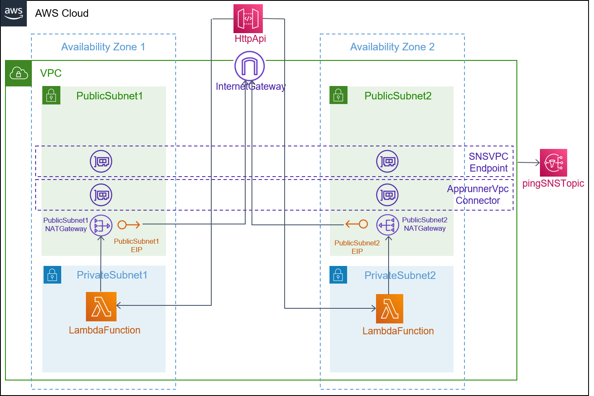

## Description

This template is compatible with the [vpc-env](../../environment-templates/vpc-env) template. It creates an Amazon API Gateway HTTP API that invokes an AWS Lambda function. The Lambda function is connect to the VPC in order to access private resources while the function is running. The function can be configured to run in a public subnet or a private subnet using the subnet_type parameter. 

Connecting the function to the public subnet doesn't give it internet access or a public IP address. To give your function access to the internet, route outbound traffic to the NAT gateway in the public subnet. The NAT gateway has a public IP address and can connect to the internet through the VPC's internet gateway. Please see [Lambda Networking](https://docs.aws.amazon.com/lambda/latest/dg/configuration-vpc.html) for more info. Since the private subnet has internet access through the NAT Gateway, Lambda functions instantiated inside the private subnet will have internet access. 

Lambda function parameters like the function handler, runtime, memory size, timeout limit, and function code's Amazon S3 URI can be specified through the service input parameters.

The template also provisions a CodePipeline based pipeline to pull your application source code before building and deploying it to the Proton service. To use sample application code, please fork the sample code repository [aws-proton-sample-services](https://github.com/aws-samples/aws-proton-sample-services). By default, the template deploys a [function](https://github.com/aws-samples/aws-proton-sample-services/tree/main/lambda-ping-sns) to send a random string and time to the shared SNS topic, whenever invoked by API Gateway HTTP API. Function in the Public subnet will use VPC Endpoint to access the SNS topic. Function connected to the private subnet uses NAT and internet gateway to reach the SNS topic. 

## Architecture

### Public Subnet


### Private Subnet


## Parameters

### Service Inputs

1. lambda_handler: The function within your code that is called to begin execution
2. lambda_memory: The size of your Lambda functions in MB
3. lambda_timeout: The timeout in seconds of your Lambda function
4. lambda_runtime: The runtime for your Lambda service
5. code_uri: The s3 link to your application
6. subnet_type: Subnet type for your function

### Pipeline Inputs

1. code_dir: Source directory for the service
2. unit_test_command: The command to run to unit test the application code
3. packaging_command: The commands which packages your code into a file called function.zip
4. environment_account_ids: The environment account ids for service instances using cross account environment

## Test
This API Gateway service can be tested by deploying the [lambda-ping-sns](https://github.com/aws-samples/aws-proton-sample-services/tree/main/lambda-ping-sns) function that sends a random message to the shared SNS topic. Expected response when you access the HTTP API Endpoint through the browser:
```
{
  "functionName": "apigw-lambda-svc-prod-function",
  "SNS_Message": "Message cliljuwybqh sent at Thu May 05 2022 21:22:16 GMT+0000 (Coordinated Universal Time)",
  "SNS_Subject": "New message from publisher"
}
```

## Security

See [CONTRIBUTING](../../CONTRIBUTING.md#security-issue-notifications) for more information.

## License

This library is licensed under the MIT-0 License. See the [LICENSE](../../LICENSE) file.

