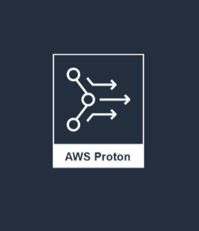

## Description

This template is compatible with the [vpc-env](../../environment-templates/vpc-env) template. It creates an AWS App Runner service that autoscales your instances based on incoming traffic and scales down to a baseline instance when there's no traffic. This option is more cost effective for HTTP services with sudden bursts in request volumes or low request volumes. The App Runner service is connected to the VPC through VPC connectors, and all outbound traffic from the service will be routed based on the VPC routing rules. The service doesn't have access to the public internet unless allowed by a route to the NAT gateway in the public subnet. Please see [App Runner VPC Support](https://aws.amazon.com/blogs/aws/new-for-app-runner-vpc-support/) for more info. 

Service parameters like port number, task size (cpu/memory units), and docker image URL can be specified through the service input parameters. 

The template also provisions a CodePipeline based pipeline to pull your application source code before building and deploying it to the Proton service. To use sample application code, please fork the sample code repository [aws-proton-sample-services](https://github.com/aws-samples/aws-proton-sample-services). By default, the template deploys a [static website](https://github.com/aws-samples/aws-proton-sample-services/tree/main/ecs-static-website) to the service. 

## Architecture

### App Runner Service

## Parameters

### Service Inputs

1. port: The port to route traffic to
2. task_size: The size of the task you want to run
3. image: The name/url of the container image

### Pipeline Inputs

1. service_dir: Source directory for the service
2. dockerfile: The location of the Dockerfile to build
3. unit_test_command: The command to run to unit test the application code
4. environment_account_ids: The environment account ids for service instances using cross account environment

## Test
The App runner service can be tested by deploying the [ecs-static-website](https://github.com/aws-samples/aws-proton-sample-services/tree/main/ecs-static-website) application that deploys a static website. Expected response when you access the App Runner Service URL through the browser:

## Security

See [CONTRIBUTING](../../CONTRIBUTING.md#security-issue-notifications) for more information.

## License

This library is licensed under the MIT-0 License. See the [LICENSE](../../LICENSE) file.

