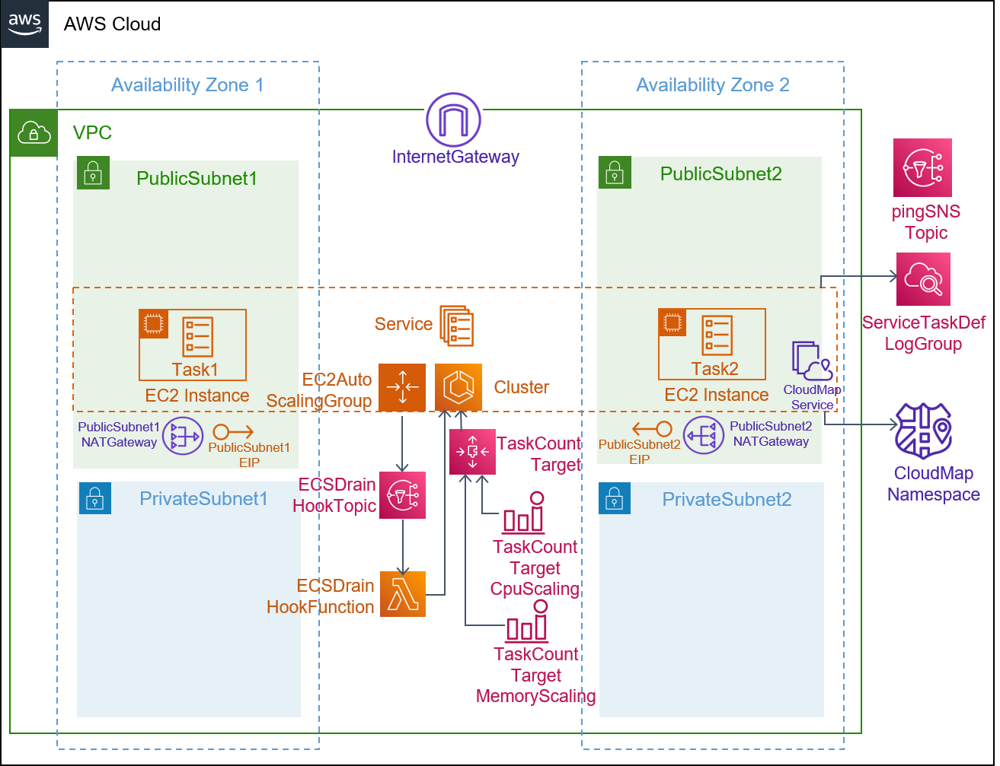
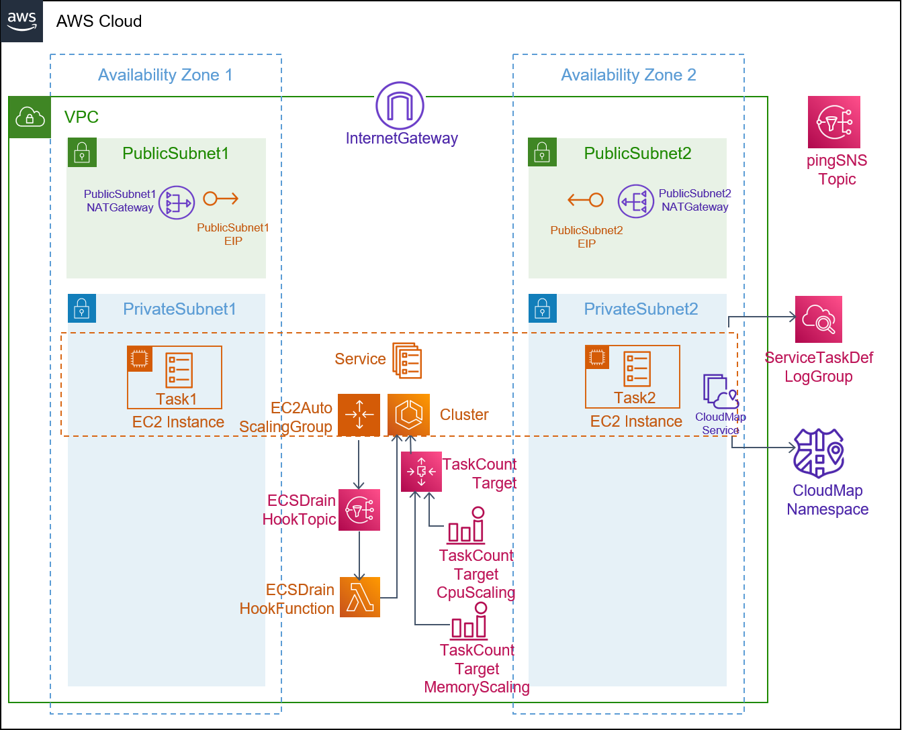

## Description

This template is compatible with the [ecs-ec2-env](../../environment-templates/ecs-ec2-env) template. It creates an ECS service running on a self-managed cluster of EC2 hosts, that can't be accessed externally. Only services running in your cluster can discover the service through Service Discovery. The service is configured to use Bridge networking utilizing Docker's built-in virutal network that runs inside each container. The bridge networking mode creates a layer between the host and the networking of the container. Please see [Amazon ECS task networking](https://docs.aws.amazon.com/AmazonECS/latest/developerguide/task-networking.html) for more information. The service uses type SRV DNS record as only SRV records are supported in bridge networking mode. Other service properties like port number, desired task count, task size (CPU/memory units), and docker image URL can be specified through the service input parameters. 

The template also provisions a CodePipeline based pipeline to pull your application source code before building and deploying it to the Proton service. To use sample application code, please fork the sample code repository [aws-proton-sample-services](https://github.com/aws-samples/aws-proton-sample-services). By default, the template deploys a [Flask app](https://github.com/aws-samples/aws-proton-sample-services/tree/main/ecs-backend), that responds with a Hello message along with the Time. 

## Architecture

### Public Subnet


### Private Subnet


## Parameters

### Service Inputs

1. port: The port to route traffic to
2. desired_count: The default number of Fargate tasks you want running
3. task_size: The size of the task you want to run
4. image: The name/url of the container image

### Pipeline Inputs

1. service_dir: Source directory for the service
2. dockerfile: The location of the Dockerfile to build
3. unit_test_command: The command to run to unit test the application code
4. environment_account_ids: The environment account ids for service instances using cross account environment

## Test
This backend service can be tested by deploying the [ecs-backend](https://github.com/aws-samples/aws-proton-sample-services/tree/main/ecs-backend) application that responds with a Hello message. We can then deploy a [load-balanced-ecs-ec2-svc](../load-balanced-ecs-ec2-svc) that runs [ecs-ping-backend-srv-record](https://github.com/aws-samples/aws-proton-sample-services/tree/main/ecs-ping-backend-srv-record) application to perform a HTTP call to the BackendURL SRV record from backend service output. Expected response when you access the the service URL for your load-balanced service through the browser:
```
{"backend_response": "Hello from backend-svc. Time: Tuesday, April 26 2022, 04:15:28"}
```

## Security

See [CONTRIBUTING](../../CONTRIBUTING.md#security-issue-notifications) for more information.

## License

This library is licensed under the MIT-0 License. See the [LICENSE](../../LICENSE) file.


