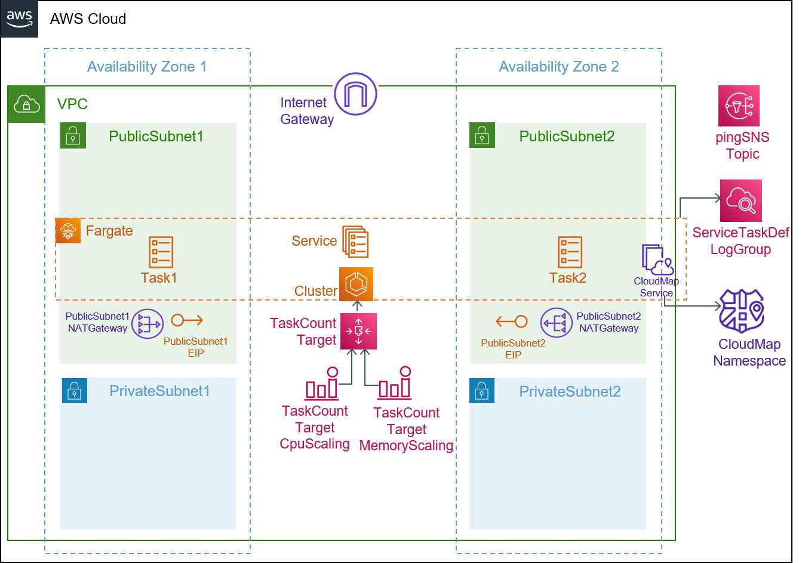
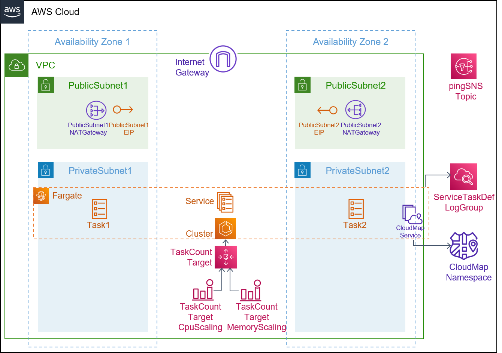

## Description

This template is compatible with the [fargate-env](../../environment-templates/fargate-env) template. It creates a Fargate service that can't be accessed externally, but only from other services in your cluster through Service Discovery. The service uses type A DNS record. The service can be configured to run in a public subnet or a private subnet using the subnet_type parameter. Other service properties like port number, desired task count, task size (CPU/memory units), and docker image URL can be specified through the service input parameters. 

The template also provisions a CodePipeline based pipeline to pull your application source code before building and deploying it to the Proton service. To use sample application code, please fork the sample code repository [aws-proton-sample-services](https://github.com/aws-samples/aws-proton-sample-services). By default, the template deploys a [Flask app](https://github.com/aws-samples/aws-proton-sample-services/tree/main/ecs-backend), that responds with a Hello message along with the Time. 


## Architecture

### Public Subnet


### Private Subnet


## Parameters

### Service Inputs

1. port: The port to route traffic to
2. desired_count: The default number of Fargate tasks you want running
3. task_size: The size of the task you want to run
4. subnet_type: Subnet type for your service
5. image: The name/url of the container image

### Pipeline Inputs

1. service_dir: Source directory for the service
2. dockerfile: The location of the Dockerfile to build
3. unit_test_command: The command to run to unit test the application code
4. environment_account_ids: The environment account ids for service instances using cross account environment

## Test
This backend service can be tested by deploying the [ecs-backend](https://github.com/aws-samples/aws-proton-sample-services/tree/main/ecs-backend) application that responds with a Hello message. We can then deploy a [load-balanced-fargate-svc](../load-balanced-fargate-svc) that runs [ecs-ping-backend-a-record](https://github.com/aws-samples/aws-proton-sample-services/tree/main/ecs-ping-backend-a-record) application to perform a HTTP call to the BackendURL A record from backend service output. Expected response when you access the the service URL for your load-balanced service through the browser:
```
{"backend_response": "Hello from backend-svc. Time: Tuesday, April 26 2022, 04:15:28"}
```

## Security

See [CONTRIBUTING](../../CONTRIBUTING.md#security-issue-notifications) for more information.

## License

This library is licensed under the MIT-0 License. See the [LICENSE](../../LICENSE) file.

