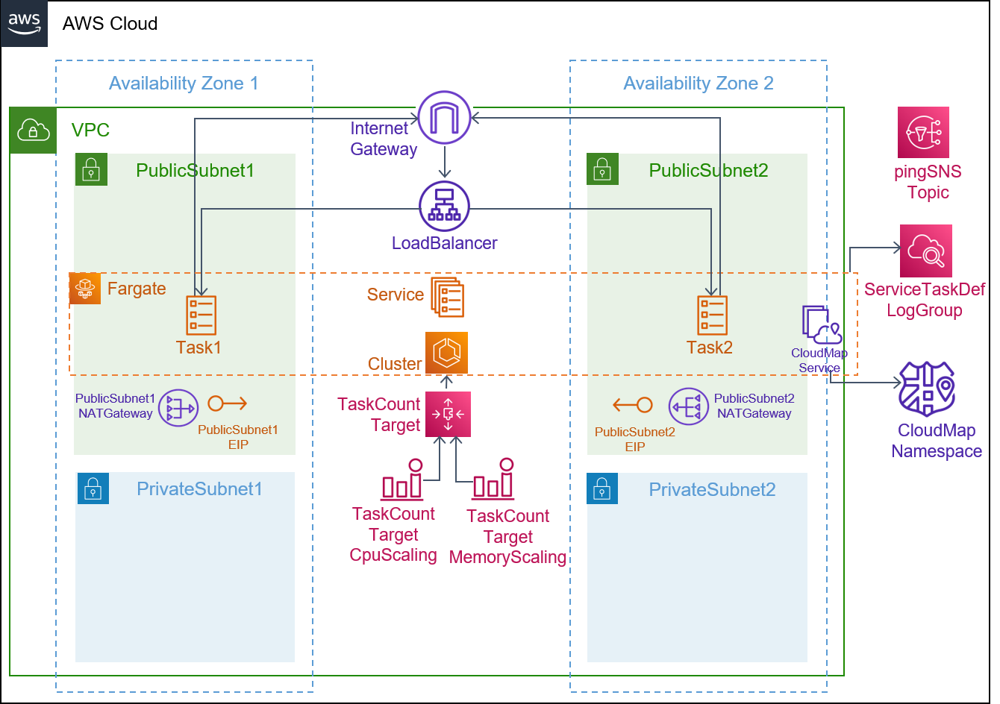
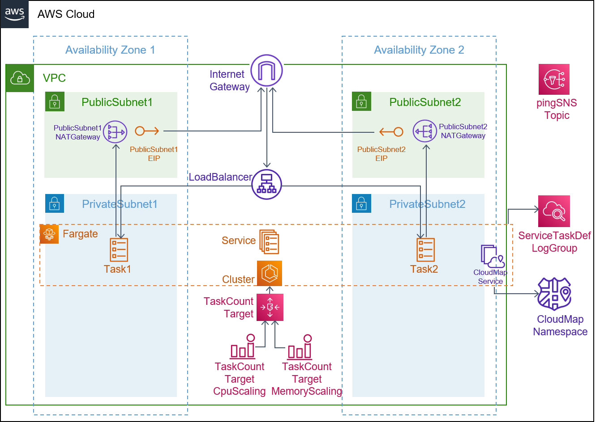

## Description

This template is compatible with the [fargate-env](../../environment-templates/fargate-env) template. It creates an ECS service running on a Fargate cluster fronted by a public facing load balancer. The loadbalancer_type parameter allows you to choose between an application load balancer and a network loadbalancer. The service can be configured to run in a Public subnet with direct internet access or in a Private subnet without direct internet access. The networking configuration of can be selected using the subnet_type parameter. Other service properties like port number, desired task count, task size (cpu/memory units), and docker image URL can be specified through the service input parameters.

The template also provisions a CodePipeline based pipeline to pull your application source code before building and deploying it to the Proton service. To use sample application code, please fork the sample code repository [aws-proton-sample-services](https://github.com/aws-samples/aws-proton-sample-services). By default, the template deploys a [static website](https://github.com/aws-samples/aws-proton-sample-services/tree/main/ecs-static-website) to the service.

## Architecture

### Public Subnet

### Private Subnet

## Parameters

### Service Inputs

1. port: The port to route traffic to
2. desired_count: The default number of Fargate tasks you want running
3. task_size: The size of the task you want to run
4. subnet_type: Subnet type for your service
5. loadbalancer_type: Type of loadbalancer to front your service
6. image: The name/url of the container image
7. backendurl: Service discovery url of the backend service

### Pipeline Inputs

1. service_dir: Source directory for the service
2. dockerfile: The location of the Dockerfile to build
3. unit_test_command: The command to run to unit test the application code
4. environment_account_ids: The environment account ids for service instances using cross account environment

### (Optional) Extend the Service with a Component

The service template which you used above will provision a Fargate service with the infrastructure required for networking, monitoring and scaling the service. In practice you may want to use a template like this for many different purposes and can use components to extend the service template to meet your requirements.

The s3-bucket-component sample provisions an S3 bucket and defines an IAM Policy for accessing it. If present, the bucket policy and bucket ARN outputs from the s3-bucket-component will be used in the ECS task role and ECS environment variables, respectively.

## Test
The load-balanced service can be tested by deploying the [ecs-static-website](https://github.com/aws-samples/aws-proton-sample-services/tree/main/ecs-static-website) application that deploys a static website. Expected response when you access the Service URL through the browser:

## Security

See [CONTRIBUTING](../../CONTRIBUTING.md#security-issue-notifications) for more information.

## License

This library is licensed under the MIT-0 License. See the [LICENSE](../../LICENSE) file.
