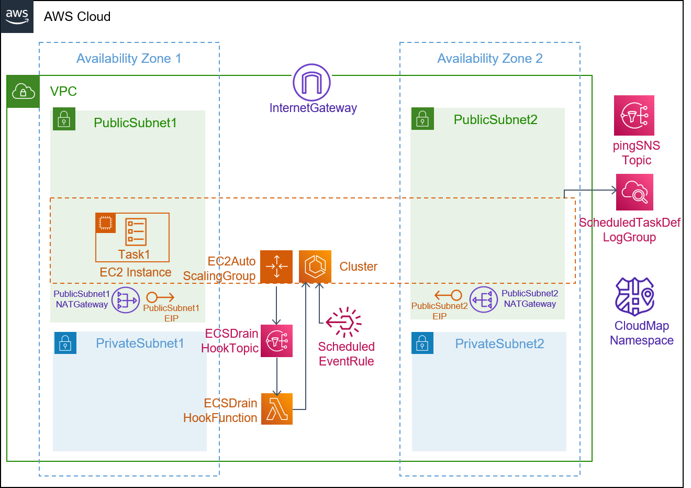
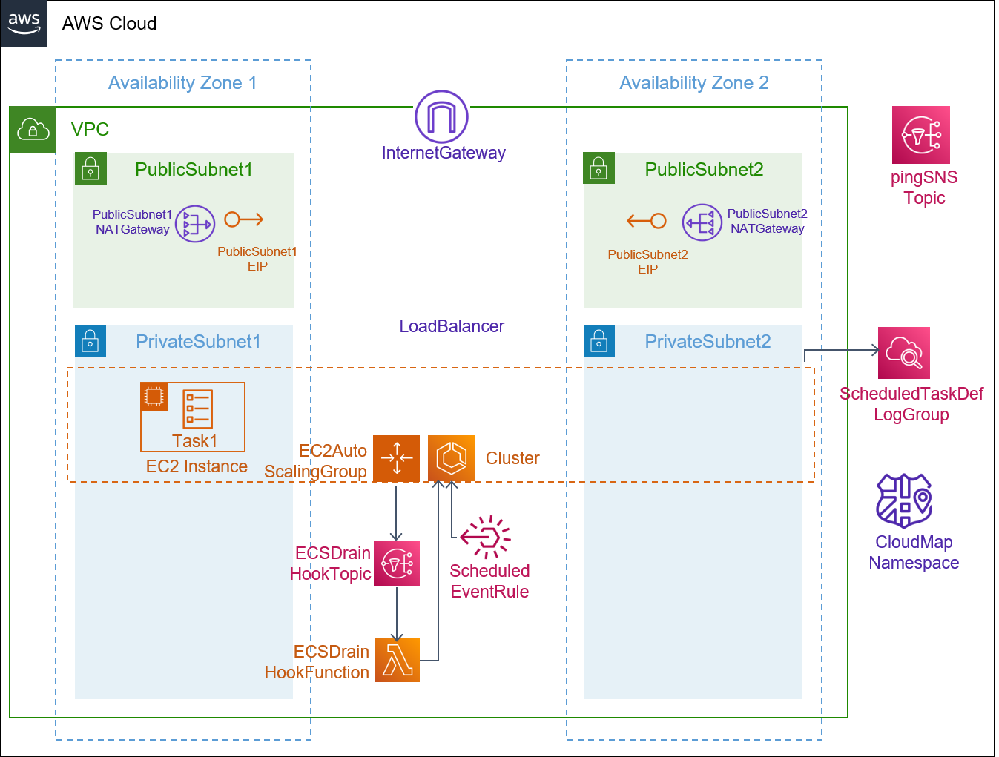

## Description

This template is compatible with the [ecs-ec2-env](../../environment-templates/ecs-ec2-env) template. It creates a scheduled ECS task running on EC2 hosts that will be initiated off of Amazon EventBridge rules either on a schedule or in response to an EventBridge event. The EventBridge event that you create can run one or more tasks in your cluster at specified times. Your scheduled event can be set to a specific interval (run every N minutes, hours, or days). Otherwise, for more complicated scheduling, you can use a cron expression. The [Schedule Expression](https://docs.aws.amazon.com/eventbridge/latest/userguide/eb-create-rule-schedule.html) can be specified using the schedule_expression input. For more information, see [Scheduled tasks](https://docs.aws.amazon.com/AmazonECS/latest/developerguide/scheduled_tasks.html). Other properties like desired task count, task size (cpu/memory units), and docker image URL can be specified through the service input parameters. 

The template also provisions a CodePipeline based pipeline to pull your application source code before building and deploying it to the Proton service. To use sample application code, please fork the sample code repository [aws-proton-sample-services](https://github.com/aws-samples/aws-proton-sample-services). By default, the template deploys a [python application](https://github.com/aws-samples/aws-proton-sample-services/tree/main/ecs-ping-sns) that sends a random 5-letter string along with the Time to the shared SNS topic, every 5 minutes. 

## Architecture

### Public Subnet

### Private Subnet

## Parameters

### Service Inputs

1. desired_count: The default number of Fargate tasks you want running
2. task_size: The size of the task you want to run
3. image: The name/url of the container image
4. schedule_expression: The schedule or rate (frequency) for EventBridge Events

### Pipeline Inputs

1. service_dir: Source directory for the service
2. dockerfile: The location of the Dockerfile to build
3. unit_test_command: The command to run to unit test the application code
4. environment_account_ids: The environment account ids for service instances using cross account environment

## Security

See [CONTRIBUTING](../../CONTRIBUTING.md#security-issue-notifications) for more information.

## License

This library is licensed under the MIT-0 License. See the [LICENSE](../../LICENSE) file.