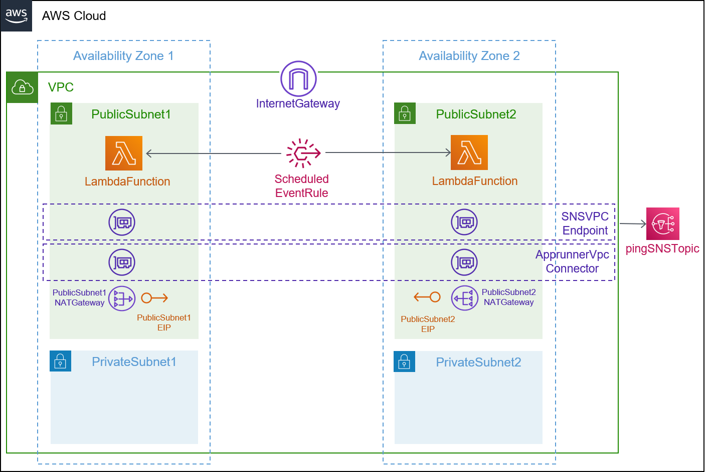

## Description

This template is compatible with the [vpc-env](../../environment-templates/vpc-env) template. It creates a [lambda function](https://docs.aws.amazon.com/serverless-application-model/latest/developerguide/sam-resource-function.html) that will be initiated off of an EventBridge rule triggered on a schedule. The scheduling expression that determines when and how often the rule runs is specified using the schedule_expression input. The Lambda function is connect to the VPC in order to access private resources while the function is running. The function can be configured to run in a Public or Private subnet using the subnet_type parameter.

Connecting the function to the public subnet doesn't give it internet access or a public IP address. To give your function access to the internet, route outbound traffic to the NAT gateway in the public subnet. The NAT gateway has a public IP address and can connect to the internet through the VPC's internet gateway. Please see [Lambda Networking](https://docs.aws.amazon.com/lambda/latest/dg/configuration-vpc.html) for more info. Since the private subnet has internet access through the NAT Gateway, lambda functions instantiated inside the private subnet will have internet access.

Lambda function parameters like the function handler, runtime, memory size, timeout limit, and function code's Amazon S3 URI can be specified through the service input parameters.

The template also provisions a CodePipeline based pipeline to pull your application source code before building and deploying it to the Proton service. To use sample application code, please fork the sample code repository [aws-proton-sample-services](https://github.com/aws-samples/aws-proton-sample-services). By default, the template deploys a [function](https://github.com/aws-samples/aws-proton-sample-services/tree/main/lambda-ping-sns) to send a random string and time to the shared SNS topic every 5 minutes. The function in the Public subnet will use VPC Endpoint to access the SNS topic. The function connected to the private subnet uses NAT and internet gateway to reach the SNS topic.

## Architecture

### Public Subnet



### Private Subnet


## Parameters

### Service Inputs

1. lambda_handler: The function within your code that is called to begin execution
2. lambda_memory: The size of your Lambda functions in MB
3. lambda_timeout: The timeout in seconds of your Lambda function
4. lambda_runtime: The runtime for your Lambda service
5. code_uri: The s3 link to your application
6. subnet_type: Subnet type for your function
7. schedule_expression: The schedule or rate (frequency) for EventBridge rule

### Pipeline Inputs

1. code_dir: Source directory for the service
2. unit_test_command: The command to run to unit test the application code
3. packaging_command: The commands which packages your code into a file called function.zip
4. environment_account_ids: The environment account ids for service instances using cross account environment

## Test

This scheduled function can be tested by deploying the [lambda-ping-sns](https://github.com/aws-samples/aws-proton-sample-services/tree/main/lambda-ping-sns) application that sends a random message to the shared SNS topic, every 5 minutes. We can then deploy a [worker-lambda-svc](../worker-lambda-svc/) that created an SQS, which subscribes to the shared SNS Topic, and triggers [lambda-worker](https://github.com/aws-samples/aws-proton-sample-services/tree/main/lambda-worker) function to write the event, context object and SQS message to CloudWatch Logs. Expected data in CloudWatch logs:

```
INFO Event:
{ "Records": [ { "messageId": "7effcc2b-d4ba-4941-a586-ee40e8b41c83", "receiptHandle": "AQEB2epQxsixNphT1pJ6W2a7ptvtqJDYXtqG2G1SCDZhGQT51GuU77u/2ya68nIOCUjZBlk/Am002E8x2zW0i5RcFi/6c1BXOIpOAZComPkFXZMD56HxDkwTmW8AA7/7xER7oVvxM9/B9nfr52p3PiofmngpMR+FAYNj5R96UflB24KNdefSy/7BVvIk45/LzhQbTySkVAo/D5wwxWPAqwBK6N0wm43CWlm6ILk9lirRbORrZPUyX5tRQyMeN6aSGdJiEm1Wl+0CxgWCvwTuUkoQaTGiEkEsbPGHR/J/iHbwHlKS7vPfxldZHZ5AjY08dzighu7qpbuRxLMBRiwKNwG4KOfArHR0YjaGEJVCRxWrEcLQBSnXo1EBHSR62UuEL6BW6Pige1jN6yjSp4fmGliaew8Y+n/7HXjCsvkDL53qPVcGQU7vA3Na5t1j3p8a6TSrMKu02amINpvfeSXB2tlRqA5Y7GqO1X504VtG4uFezIU=", "body": "{\n "Type" : "Notification",\n "MessageId" : "76f49e3f-97eb-5e9f-8645-c4d758c3d592",\n "TopicArn" : "arn:aws:sns:us-east-2:XXXXXXXXXXXX:AWSProton-vpc-env-prod-cloudformation--QYWPQLSESXEMRBY-ping",\n "Subject" : "New message from publisher",\n "Message" : "Message 3x3txhl9i2 sent at Sun May 01 2022 18:09:44 GMT+0000 (Coordinated Universal Time)",\n "Timestamp" : "2022-05-01T18:09:44.076Z",\n "SignatureVersion" : "1",\n "Signature" : "G6ef1WJyfFGgHS8dh1sHCjruxIs0A1D0dbpb67rFvUOWYiR8K5oWk4HgMTQ4UrGVUKLtRhwFF9UNVSYINePm9M/KmYhKLldDtg0VzBTJ90uu98XunFFeeSuS/Jw6zilBhIOKV+Bveq+s0FrmJDmrXx9N7yOkruD/azVUd/o1k+QSqlpkRqT5pDW2eVIHFnjn2uKEaZjDR71sCAuhlzXmlNOuFMMvc6OSVqvHfGnhnQJVOfYSJwNKCpXR6Y1F0+i2ubDIEjQHGi6qvYsRFlkpRdS2jJA0xsad6nwecH8bWPgQ+O0l0z63HJDw+ghGyl7kM+3RfRPpSwNsZhLMeL/frA==",\n "SigningCertURL" : "https://sns.us-east-2.amazonaws.com/SimpleNotificationService-7ff5318490ec183fbaddaa2a969abfda.pem",\n "UnsubscribeURL" : "https://sns.us-east-2.amazonaws.com/?Action=Unsubscribe&SubscriptionArn=arn:aws:sns:us-east-2:XXXXXXXXXXXX:AWSProton-vpc-env-prod-cloudformation--QYWPQLSESXEMRBY-ping:dc8974a0-3710-4b29-a078-7d0d5f53c844"\n}", "attributes": { "ApproximateReceiveCount": "1", "SentTimestamp": "1651428584109", "SenderId": "AIDAJQR6QDGQ7PATMSYEY", "ApproximateFirstReceiveTimestamp": "1651428584110" }, "messageAttributes": {}, "md5OfBody": "20d9c6741a7b6f8858309bb6e78dd5aa", "eventSource": "aws:sqs", "eventSourceARN": "arn:aws:sqs:us-east-2:XXXXXXXXXXXX:AWSProton-worker-lambda-s-worker-lambda-s-cloudformation-MySqsQueue-U5YMDp8VFYEJ", "awsRegion": "us-east-2" } ] }

INFO Context:
{ "callbackWaitsForEmptyEventLoop": true, "functionVersion": "$LATEST", "functionName": "worker-lambda-svc-prod-function", "memoryLimitInMB": "512", "logGroupName": "/aws/lambda/worker-lambda-svc-prod-function", "logStreamName": "2022/05/01/[$LATEST]6d56308e4e9344168158554db14e720e", "invokedFunctionArn": "arn:aws:lambda:us-east-2:XXXXXXXXXXXX:function:worker-lambda-svc-prod-function", "awsRequestId": "06831dc6-8bfd-5d2a-9f9a-472e44e198a5" }

INFO { "Type": "Notification", "MessageId": "76f49e3f-97eb-5e9f-8645-c4d758c3d592", "TopicArn": "arn:aws:sns:us-east-2:XXXXXXXXXXXX:AWSProton-vpc-env-prod-cloudformation--QYWPQLSESXEMRBY-ping", "Subject": "New message from publisher", "Message": "Message 3x3txhl9i2 sent at Sun May 01 2022 18:09:44 GMT+0000 (Coordinated Universal Time)", "Timestamp": "2022-05-01T18:09:44.076Z", "SignatureVersion": "1", "Signature": "G6ef1WJyfFGgHS8dh1sHCjruxIs0A1D0dbpb67rFvUOWYiR8K5oWk4HgMTQ4UrGVUKLtRhwFF9UNVSYINePm9M/KmYhKLldDtg0VzBTJ90uu98XunFFeeSuS/Jw6zilBhIOKV+Bveq+s0FrmJDmrXx9N7yOkruD/azVUd/o1k+QSqlpkRqT5pDW2eVIHFnjn2uKEaZjDR71sCAuhlzXmlNOuFMMvc6OSVqvHfGnhnQJVOfYSJwNKCpXR6Y1F0+i2ubDIEjQHGi6qvYsRFlkpRdS2jJA0xsad6nwecH8bWPgQ+O0l0z63HJDw+ghGyl7kM+3RfRPpSwNsZhLMeL/frA==", "SigningCertURL": "https://sns.us-east-2.amazonaws.com/SimpleNotificationService-7ff5318490ec183fbaddaa2a969abfda.pem", "UnsubscribeURL": "https://sns.us-east-2.amazonaws.com/?Action=Unsubscribe&SubscriptionArn=arn:aws:sns:us-east-2:XXXXXXXXXXXX:AWSProton-vpc-env-prod-cloudformation--QYWPQLSESXEMRBY-ping:dc8974a0-3710-4b29-a078-7d0d5f53c844" }
```

## Security

See [CONTRIBUTING](../../CONTRIBUTING.md#security-issue-notifications) for more information.

## License

This library is licensed under the MIT-0 License. See the [LICENSE](../../LICENSE) file.
