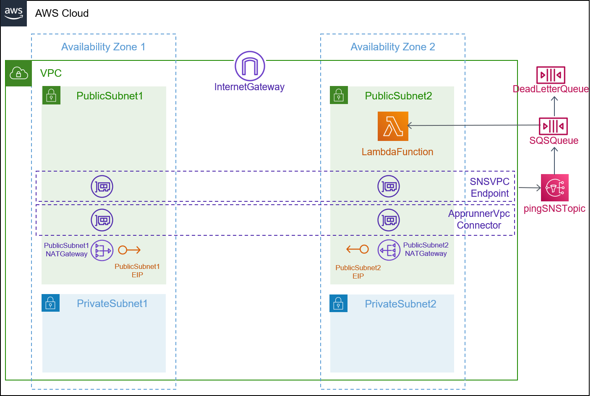
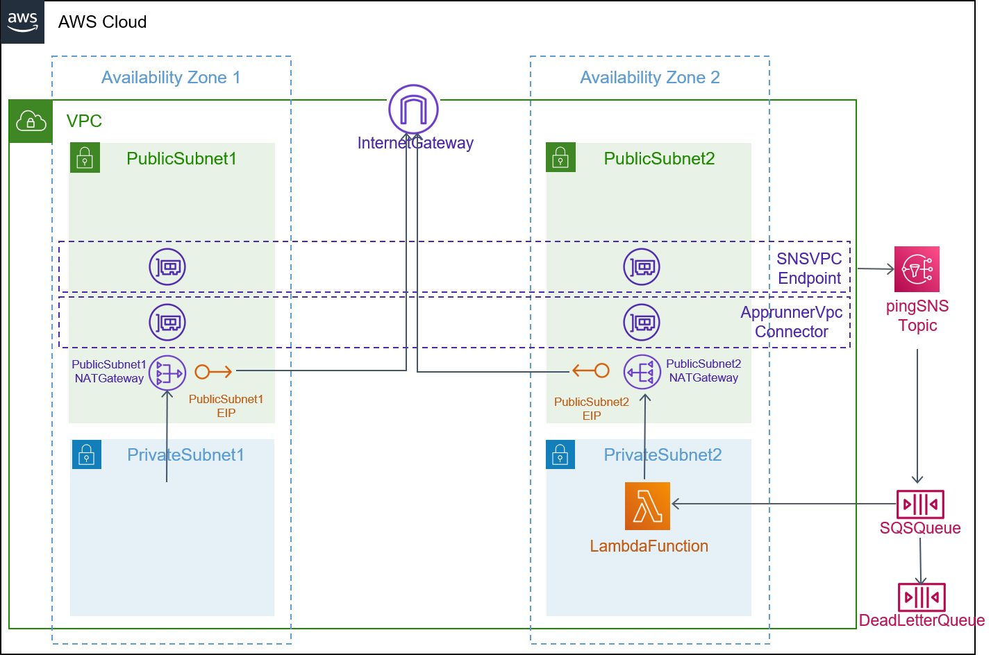

## Description

This template is compatible with the [vpc-env](../../environment-templates/vpc-env) template. It uses AWS Serverless Application Model (SAM) to create a [lambda function](https://docs.aws.amazon.com/serverless-application-model/latest/developerguide/sam-resource-function.html) that will be invoked by an SQS queue when new messages are available. Other microservices in your environment can publish events to the shared [Amazon SNS topic](https://docs.aws.amazon.com/sns/latest/dg/welcome.html) that can then be consumed by this Worker Service. 

The Lambda function is connect to the VPC in order to access private resources while the function is running. The function can be configured to run in a Public subnet or a Privat subnet using the subnet_type parameter. Connecting the function to the public subnet doesn't give it internet access or a public IP address. To give your function access to the internet, route outbound traffic to the NAT gateway in the public subnet. The NAT gateway has a public IP address and can connect to the internet through the VPC's internet gateway. Please see [Lambda Networking](https://docs.aws.amazon.com/lambda/latest/dg/configuration-vpc.html) for more info. Since the private subnet has internet access through the NAT Gateway, lambda functions instantiated inside the private subnet will have internet access. 

Lambda function parameters like the function handler, runtime, memory size, timeout limit, and function code's Amazon S3 URI can be specified through the service input parameters.

The template also provisions a CodePipeline based pipeline to pull your application source code before building and deploying it to the Proton service. To use sample application code, please fork the sample code repository [aws-proton-sample-services](https://github.com/aws-samples/aws-proton-sample-services). By default, the template deploys a [function](https://github.com/aws-samples/aws-proton-sample-services/tree/main/lambda-worker) that writes the event, context object and SQS message to CloudWatch Logs. 

## Architecture

### Public Subnet


### Private Subnet


## Parameters

### Service Inputs

1. lambda_handler: The function within your code that is called to begin execution
2. lambda_memory: The size of your Lambda functions in MB
3. lambda_timeout: The timeout in seconds of your Lambda function
4. lambda_runtime: The runtime for your Lambda service
5. code_uri: The s3 link to your application
6. subnet_type: Subnet type for your function

### Pipeline Inputs

1. code_dir: Source directory for the service
2. unit_test_command: The command to run to unit test the application code
3. packaging_command: The commands which packages your code into a file called function.zip
4. environment_account_ids: The environment account ids for service instances using cross account environment

## Test
This worker function can be tested by deploying the [lambda-worker](https://github.com/aws-samples/aws-proton-sample-services/tree/main/lambda-worker) function that write the event, context object and SQS message to CloudWatch Logs. We can then deploy a [scheduled-lambda-svc](../scheduled-lambda-svc/) that runs [lambda-ping-sns](https://github.com/aws-samples/aws-proton-sample-services/tree/main/lambda-ping-sns) application that sends a random message to the shared SNS topic, every 5 minutes. Expected data in CloudWatch logs:
```
INFO Event:
{ "Records": [ { "messageId": "7effcc2b-d4ba-4941-a586-ee40e8b41c83", "receiptHandle": "AQEB2epQxsixNphT1pJ6W2a7ptvtqJDYXtqG2G1SCDZhGQT51GuU77u/2ya68nIOCUjZBlk/Am002E8x2zW0i5RcFi/6c1BXOIpOAZComPkFXZMD56HxDkwTmW8AA7/7xER7oVvxM9/B9nfr52p3PiofmngpMR+FAYNj5R96UflB24KNdefSy/7BVvIk45/LzhQbTySkVAo/D5wwxWPAqwBK6N0wm43CWlm6ILk9lirRbORrZPUyX5tRQyMeN6aSGdJiEm1Wl+0CxgWCvwTuUkoQaTGiEkEsbPGHR/J/iHbwHlKS7vPfxldZHZ5AjY08dzighu7qpbuRxLMBRiwKNwG4KOfArHR0YjaGEJVCRxWrEcLQBSnXo1EBHSR62UuEL6BW6Pige1jN6yjSp4fmGliaew8Y+n/7HXjCsvkDL53qPVcGQU7vA3Na5t1j3p8a6TSrMKu02amINpvfeSXB2tlRqA5Y7GqO1X504VtG4uFezIU=", "body": "{\n "Type" : "Notification",\n "MessageId" : "76f49e3f-97eb-5e9f-8645-c4d758c3d592",\n "TopicArn" : "arn:aws:sns:us-east-2:XXXXXXXXXXXX:AWSProton-vpc-env-prod-cloudformation--QYWPQLSESXEMRBY-ping",\n "Subject" : "New message from publisher",\n "Message" : "Message 3x3txhl9i2 sent at Sun May 01 2022 18:09:44 GMT+0000 (Coordinated Universal Time)",\n "Timestamp" : "2022-05-01T18:09:44.076Z",\n "SignatureVersion" : "1",\n "Signature" : "G6ef1WJyfFGgHS8dh1sHCjruxIs0A1D0dbpb67rFvUOWYiR8K5oWk4HgMTQ4UrGVUKLtRhwFF9UNVSYINePm9M/KmYhKLldDtg0VzBTJ90uu98XunFFeeSuS/Jw6zilBhIOKV+Bveq+s0FrmJDmrXx9N7yOkruD/azVUd/o1k+QSqlpkRqT5pDW2eVIHFnjn2uKEaZjDR71sCAuhlzXmlNOuFMMvc6OSVqvHfGnhnQJVOfYSJwNKCpXR6Y1F0+i2ubDIEjQHGi6qvYsRFlkpRdS2jJA0xsad6nwecH8bWPgQ+O0l0z63HJDw+ghGyl7kM+3RfRPpSwNsZhLMeL/frA==",\n "SigningCertURL" : "https://sns.us-east-2.amazonaws.com/SimpleNotificationService-7ff5318490ec183fbaddaa2a969abfda.pem",\n "UnsubscribeURL" : "https://sns.us-east-2.amazonaws.com/?Action=Unsubscribe&SubscriptionArn=arn:aws:sns:us-east-2:XXXXXXXXXXXX:AWSProton-vpc-env-prod-cloudformation--QYWPQLSESXEMRBY-ping:dc8974a0-3710-4b29-a078-7d0d5f53c844"\n}", "attributes": { "ApproximateReceiveCount": "1", "SentTimestamp": "1651428584109", "SenderId": "AIDAJQR6QDGQ7PATMSYEY", "ApproximateFirstReceiveTimestamp": "1651428584110" }, "messageAttributes": {}, "md5OfBody": "20d9c6741a7b6f8858309bb6e78dd5aa", "eventSource": "aws:sqs", "eventSourceARN": "arn:aws:sqs:us-east-2:XXXXXXXXXXXX:AWSProton-worker-lambda-s-worker-lambda-s-cloudformation-MySqsQueue-U5YMDp8VFYEJ", "awsRegion": "us-east-2" } ] }

INFO Context:
{ "callbackWaitsForEmptyEventLoop": true, "functionVersion": "$LATEST", "functionName": "worker-lambda-svc-prod-function", "memoryLimitInMB": "512", "logGroupName": "/aws/lambda/worker-lambda-svc-prod-function", "logStreamName": "2022/05/01/[$LATEST]6d56308e4e9344168158554db14e720e", "invokedFunctionArn": "arn:aws:lambda:us-east-2:XXXXXXXXXXXX:function:worker-lambda-svc-prod-function", "awsRequestId": "06831dc6-8bfd-5d2a-9f9a-472e44e198a5" }

INFO { "Type": "Notification", "MessageId": "76f49e3f-97eb-5e9f-8645-c4d758c3d592", "TopicArn": "arn:aws:sns:us-east-2:XXXXXXXXXXXX:AWSProton-vpc-env-prod-cloudformation--QYWPQLSESXEMRBY-ping", "Subject": "New message from publisher", "Message": "Message 3x3txhl9i2 sent at Sun May 01 2022 18:09:44 GMT+0000 (Coordinated Universal Time)", "Timestamp": "2022-05-01T18:09:44.076Z", "SignatureVersion": "1", "Signature": "G6ef1WJyfFGgHS8dh1sHCjruxIs0A1D0dbpb67rFvUOWYiR8K5oWk4HgMTQ4UrGVUKLtRhwFF9UNVSYINePm9M/KmYhKLldDtg0VzBTJ90uu98XunFFeeSuS/Jw6zilBhIOKV+Bveq+s0FrmJDmrXx9N7yOkruD/azVUd/o1k+QSqlpkRqT5pDW2eVIHFnjn2uKEaZjDR71sCAuhlzXmlNOuFMMvc6OSVqvHfGnhnQJVOfYSJwNKCpXR6Y1F0+i2ubDIEjQHGi6qvYsRFlkpRdS2jJA0xsad6nwecH8bWPgQ+O0l0z63HJDw+ghGyl7kM+3RfRPpSwNsZhLMeL/frA==", "SigningCertURL": "https://sns.us-east-2.amazonaws.com/SimpleNotificationService-7ff5318490ec183fbaddaa2a969abfda.pem", "UnsubscribeURL": "https://sns.us-east-2.amazonaws.com/?Action=Unsubscribe&SubscriptionArn=arn:aws:sns:us-east-2:XXXXXXXXXXXX:AWSProton-vpc-env-prod-cloudformation--QYWPQLSESXEMRBY-ping:dc8974a0-3710-4b29-a078-7d0d5f53c844" }
```

## Security

See [CONTRIBUTING](../../CONTRIBUTING.md#security-issue-notifications) for more information.

## License

This library is licensed under the MIT-0 License. See the [LICENSE](../../LICENSE) file.

